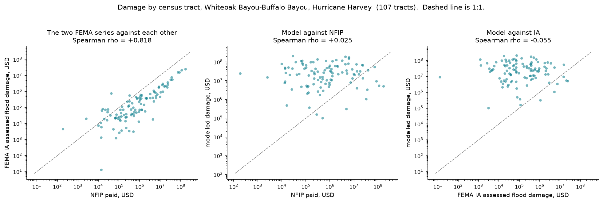

# floodline

Flood extent, exposure and damage estimation from a DEM and a gauge reading.

Given a lidar DEM, a stream network and a discharge at a river gauge, floodline
produces an inundation extent and depth raster (HAND method), intersects it with
building footprints and population grids, and estimates people affected and direct
economic damage using depth–damage curves, with a Monte Carlo uncertainty band.

**The claim being tested:** a screening-grade flood damage model built from open data
can reproduce the extent of a real major flood to within a stated error and put the
observed building count inside its 90% interval.

**How far that claim has actually been taken.** The extent half is measured across
**16 watersheds nationally, against 1,287 quality-1/2 surveyed high-water marks**: the
modelled water surface has a **median RMSE of 2.16 m**, ranging from 0.97 m to 11.85 m.
Only 3 of the 16 come in under 1.5 m. The exposure and damage half runs end to end and
is tested, but has not been validated against anything — see
[Damage: what is and is not trustworthy](#damage-what-is-and-is-not-trustworthy).
CSI is not reported at all, because it needs an observed extent polygon and the
Sentinel-1 route was dropped for want of credentials.

**Read the median, not the best case.** An earlier version of this file quoted 1.38 m
from Whiteoak Bayou alone. That number is real and reproducible, and it is the best
decile — quoting it as *the* accuracy was the single most misleading thing in this
repository. The national picture is roughly 2 m, with a tail.

The full brief is in [docs/SPEC.md](docs/SPEC.md); the working rules are in
[CONTRIBUTING.md](CONTRIBUTING.md).

## Three findings

Read these before the architecture. Each is measured, each is reproducible with
`floodline reproduce`, and two of the three are negative.

**1. Stage is not the dominant error, and the uncertainty budget had said the opposite
for months.** Sampling each Monte Carlo term alone, as a share of the point estimate:
stage 100%, replacement cost 84%, curve and family together 16%, DEM 8%. The code had
claimed curve family was the largest term; that was reasoning, never measured, and
wrong. Separately, replacing the modelled stage with observed peak levels interpolated
between every gauge in a basin took median RMSE from 2.08 m to 1.52 m and improved all
eleven basins that completed. But marks sitting *on* a gauged reach, where stage error
is essentially nil, still carry 1.58 m against 1.96 m for marks far from any gauge.
**Stage was worth half a metre; the remaining metre and a half is HAND and the DEM, and
no further work on stage will reach past it.**

**2. Channel bathymetry does not rescue Manning's n.** The hypothesis was that lidar
images the water surface, so channel capacity is under-counted, so the roughness sweep
ran to a value smoother than glass because n was standing in for a missing channel. The
channel was restored - `d = 0.381·A^0.246`, fitted from 36,308 USGS field measurements
at 116 Texas Gulf Coast gauges - and the held-out optimum stayed pinned at the bottom of
the grid, exactly as before. The criterion was set in advance and not met, so
bathymetry is off by default and n stays at 0.035. The code stays too, tested and one
flag away, because deleting a negative result is how it gets rediscovered.

**3. The damage model fails its first real test.** Modelled damage per census tract has
essentially no rank correlation with either FEMA series for Harvey - +0.025 against NFIP
claims paid, −0.055 against Individual Assistance assessed damage - while the two FEMA
series, which sample almost complementary populations, agree with each other at +0.818.
The signal is real and the model does not reproduce it. **This model can say roughly how
deep the water was over a basin; it cannot say which neighbourhoods lost the most
money.** See [Dollars against FEMA's own record](#dollars-against-femas-own-record).

## What this method cannot do

Stated first, on purpose. HAND is a screening model, not a hydraulic one.

- **HAND assumes the water surface is parallel to the drainage line.** It has no
  representation of backwater, levees, culverts, or flow routed across a catchment
  boundary. The Addicks and Barker reservoir releases during Harvey are a sharp
  demonstration: water arrived downstream by a controlled release that no
  terrain-following model can infer.
- **One gauge is not one stage for a whole reach.** A single stage applied to every
  reach is an approximation whose error grows with distance from the gauge.
- **Sentinel-1 is a lower bound on urban extent.** SAR misses water under tree canopy
  and in dense urban areas (double bounce), so agreement metrics against it are not
  symmetric in meaning. That is why the primary reference here is surveyed
  high-water marks — 1,287 of them across 16 watersheds — with SAR as a secondary
  check.
- **Population grids disagree with each other by tens of percent** in small towns.
  floodline reports Census block groups, WorldPop and HRSL rather than picking one —
  but they agree far better across a metro the size of Houston than they would in a
  small town, so this comparison is weaker here than it would have been at Lismore.
  That is the main thing given up by choosing Harvey as the primary case.

## Where it stands against ground truth

### Nationally: 16 watersheds, 1,287 marks

Every HUC-10 in the country holding at least eight quality-1/2 marks, scored by the
same code at 30 m with no per-basin tuning. Coastal marks are excluded — HAND has no
surge term, so scoring against them measures an absent mechanism rather than a fit.
Eight further basins were refused outright for having no gauge, and two dropped out
because every mark in them was coastal.

| Watershed | HUC-10 | Marks | RMSE | Bias | Marks wet |
|---|---|---|---|---|---|
| Clear Creek | `0708020901` | 36 | 0.97 m | -0.03 m | 97% |
| Black Hawk Creek | `0708020506` | 19 | 1.33 m | +0.76 m | 84% |
| Elk Creek | `1003010405` | 50 | 1.49 m | -0.74 m | 14% |
| Sugar Creek-South Skunk River | `0708010509` | 88 | 1.65 m | -0.50 m | 95% |
| Meramec River | `0714010210` | 76 | 1.89 m | -1.08 m | 4% |
| Rock Creek | `1007000609` | 82 | 1.97 m | -0.15 m | 11% |
| Rio Ruidoso | `1306000801` | 160 | 2.04 m | +1.06 m | 51% |
| Gills Creek | `0305011002` | 200 | 2.08 m | -0.77 m | 13% |
| Trail Creek-Yellowstone River | `1007000204` | 90 | 2.24 m | +0.59 m | 41% |
| Keg Creek-Missouri River | `1024000101` | 61 | 2.40 m | -2.08 m | 0% |
| San Lorenzo River | `1806001502` | 16 | 2.41 m | -0.97 m | 94% |
| Bloody Run-East Fork Des Moines River | `0710000309` | 23 | 2.42 m | +0.81 m | 91% |
| Lower Deerfield River | `0108020305` | 68 | 2.80 m | +1.44 m | 66% |
| Headwaters Guadalupe River | `1210020101` | 118 | 3.19 m | +0.25 m | 49% |
| Blue Creek-Cedar River | `0708020515` | 92 | 4.00 m | +0.68 m | 76% |
| Miller Creek-Cedar River | `0708020509` | 108 | 11.85 m | +8.34 m | 95% |

**Median RMSE 2.16 m. Three of sixteen under 1.5 m. One basin at 11.85 m.** Bias has
no consistent sign — median +0.11 m, spanning −2.08 m to +8.34 m — so there is no
single offset to correct. The model is roughly unbiased across the country and
unreliable in any one place, which is the honest shape of a screening method.

**It leaves 53% of surveyed riverine marks dry.** 677 of 1,287 places where water
demonstrably reached are outside the modelled extent. High-water marks cannot show the
opposite error — nobody surveys a mark where the water never came — so the true extent
error is worse than this in an unmeasured direction.

Miller Creek–Cedar River (`0708020509`, RMSE 11.85 m, bias +8.34 m) is not explained
and is left in. Dropping the basin that disagrees is how a validation becomes a
selection.

### The reference basin, and why it flatters the method

Whiteoak Bayou–Buffalo Bayou (HUC 1204010403, 491 km² at 10 m, Harvey peak
1,433 m³/s at gauge 08074500) is where the method was developed, and it sits in the
best decile of the table above. It is kept here because the comparison against the
alternatives is the useful part, not because the number is representative — it is not.

The three rows below are the original like-for-like experiment on all 16 quality-1/2
marks in the unit. One of those 16 is labelled Coastal by USGS and is no longer scored
anywhere else in this repository; the table keeps it so the three methods are still
compared on identical ground truth. **On the current 15-mark scored set the per-reach
model gives RMSE 1.17 m, bias +0.40 m, 47% within 1 m, extent 117.4 km² (24%)** — the
excluded mark was an outlier, so the current figure is better than the one below.

| | mean residual | RMSE | within 1 m | modelled extent |
|---|---|---|---|---|
| Constant stage from one gauge | +6.72 m | 7.86 m | 12% | 464 km² (98% of the unit) |
| Best-fit constant, fitted to the marks | −0.74 m | 4.13 m | 0% | — |
| **Per-reach synthetic rating curves** | **+1.04 m** | **1.38 m** | **50%** | **117 km² (25%)** |

Two things that matter more than the headline number.

**A constant HAND threshold cannot work here, at any value.** The threshold that
would place the water correctly ranges from −0.19 m to 12.32 m across those 16
points, because HAND measures each floodplain cell against its *nearest* drainage —
usually a small tributary, not the main stem. Fitting the best possible single value
still misses every mark by more than a metre. Giving each reach its own stage from
its own geometry is what fixes it.

**Finer data made the constant-threshold model worse, not better.** At 30 m the
channel bed at the gauge reads 4.81 m NAVD88; at 10 m it reads 0.89 m, because 10 m
resolves the channel. `stage − bed` therefore grew from 7.97 m to 11.89 m and
everything flooded deeper. Resolution only helps once the stage conversion is right.

**And the improvement cost recall.** 10 of 16 marks now fall inside the modelled
extent, against 16 of 16 before. The old model "hit" every mark by flooding 98% of
the watershed. This is exactly why hit rate alone is a useless metric and why CSI
and bias are reported alongside it.

### Does a finer grid help?

Hunting Bayou (HUC-12 120401040701, 106 km², 14 quality-1/2 riverine marks), scored on
two grids from two different real products rather than one resampled to both.

| grid | source | cells | RMSE | bias | median abs error | marks wet | extent |
|---|---|---|---|---|---|---|---|
| 30 m | 1 arc-second | 218 k | **0.45 m** | −0.11 m | 0.48 m | 11 / 13 | 27.6 km² |
| 10 m | 1/3 arc-second | 1.96 M | 0.74 m | −0.02 m | **0.36 m** | 9 / 14 | 31.7 km² |

**Finer is better on the typical mark and worse on the tail.** The 10 m grid has a
lower median absolute error and almost no bias, and a higher RMSE, which is what
happens when a resolution resolves the channel: cells the coarse grid flooded now drain,
two more marks fall dry, and each dry mark contributes a large residual. Nine of
fourteen wet at 10 m against eleven of thirteen at 30 m is the same effect counted
directly.

So the honest answer is that resolution buys accuracy where the model is already
roughly right and costs recall where it is not, and 30 m remains the default because
the headline metric does not improve and the run is nine times the cells.

**1 m and 5 m are missing, and the reason is data rather than method.** 3DEP publishes
1 m lidar over this basin - 39 tiles - but every attempt to range-read them failed on
S3 after two runs with extended retries. A 1 m grid over the finest hydrologic unit
Texas publishes would also be 196 million cells, and no HUC-14 or HUC-16 exists there
to make it smaller, so this experiment cannot be completed at 1 m on a whole basin
without a different unit of analysis.

## Status

Terrain, hydraulics, exposure and damage all run. Validation is where the gaps are:
extent is measured against surveyed high-water marks, and nothing else is measured
against anything. Every number in this README was produced by running the code on
this machine.

| Phase | Scope | State |
|---|---|---|
| 0 | Scaffold, config, raster I/O, synthetic fixture, CLI, CI | done |
| 1 | `fill`, `flowdir`, `flowacc`, `streams`, `hand` — numba, property-tested | done, plus flat resolution |
| 2 | Stage handling, inundation, buildings, population | done |
| 3 | Depth–damage curves, costs, Monte Carlo | code done; curve constants unverified |
| 4 | Extent metrics, resolution experiment, claim comparison | done — bar a SAR reference |
| 5 | Rendered report | done |
| — | Live compute service and national map UI (unplanned, built anyway) | done |
| — | Overture and population fetchers, flood-frequency context, `assess` | done |
| — | NSI structure values, USACE curves, damage on the map | done |

Every pipeline stage now runs; the one remaining refusal is `condition --streams`,
since stream burning is not implemented and is declined rather than faked.

### The headline claim, tested

The README says a screening model should put the observed building count inside its
90% interval. Here is that test, run:

| | Whiteoak Bayou, Harvey |
|---|---|
| modelled inundated | 33,279 (90% interval 17,185 – 50,004, 1,000 draws) |
| NFIP claims filed inside the watershed | 6,769, area-weighted from block groups |
| paid on those claims | USD 705 M |
| modelled damage | USD 7.95 bn (structure 3.51, contents 4.44) |
| loss ratio | 4.2% of USD 191 bn exposed |

**The interval does not contain the claim count, and it should not.** An NFIP claim
requires a property to be insured, flooded, and its owner to file. Take-up outside
mapped floodplains was a small fraction of Houston's stock, and Harvey flooded a great
deal of ground outside them. So 6,769 is a *floor*, not a count of flooded buildings,
and the model sitting 4.9× above it is the expected direction. What would falsify the
model is the other direction: an interval whose top sat below the claims. It does not,
and `ClaimComparison.model_below_claims` is the check.

The dollar comparison carries the same asymmetry harder — modelled damage is 11× what
NFIP paid, because NFIP caps a building claim at USD 250,000 and covers only insured
filers. Neither ratio validates the model. Both bound it, and the bound is one-sided.

Claim coordinates are published rounded to 0.1° (~11 km), useless at watershed scale;
`censusBlockGroupFips` is what makes this possible, with block groups straddling the
boundary weighted by area share.

### The resolution experiment

Whiteoak Bayou, Harvey peak, scored against the same 16 graded high-water marks at
each resolution:

| cell | cells | flooded | max depth | RMSE | bias | median abs | marks wet | runtime |
|---|---|---|---|---|---|---|---|---|
| 10 m | 9.9 M | 117.4 km² | 18.3 m | **1.21 m** | +0.26 m | 1.22 m | 9 / 16 | 39 s |
| 30 m | 1.1 M | 112.2 km² | 10.9 m | **1.26 m** | +0.04 m | 0.84 m | 12 / 16 | 15 s |

**Finer is not better here, and that is the finding.** RMSE is a rounding difference
apart on 16 marks — well inside noise — while at 10 m the median absolute error is
*worse* (1.22 m against 0.84 m), the model wets three fewer marks, and it costs 2.6×
the runtime. 30 m is the default for that reason, not for speed.

The mechanism is HAND itself. Height above nearest drainage is measured relative to
the channel, and a finer DEM resolves the channel bed deeper, which raises HAND for
every cell around it, so the same stage floods less ground. Max modelled depth goes
from 10.9 m to 18.3 m for the same reason: at 10 m the grid finds channel cells the
30 m grid averages away. Refining the DEM does not refine the answer — it moves the
datum the whole method is built on.

Two resolutions are missing and neither is an oversight. **3 m** (1/9 arc-second) has
no 3DEP coverage over Houston at all. **1 m** does — 39 tiles — and runs: 138 M cells
in 389 s over a HUC-12. But 994 M cells over the HUC-10 is past what fits in one pass,
and the HUC-12 that does fit contains only 2 surveyed marks, which cannot score
anything. So 1 m is demonstrated to run and not demonstrated to help.

**What phase 4 still lacks is a reference for extent, not code.** `floodline validate` computes
CSI, hit rate, false alarm ratio and bias against an observed wet mask you supply, and
is verified against a hand-computed CSI. floodline has no observed extent of its own:
the Sentinel-1 route needs credentials, so no CSI is reported for Harvey. Validation
that *is* reported runs against 1,287 surveyed high-water marks in 16 watersheds.
The resolution and
population experiments have not been written up, though the population disagreement has
already shown itself — WorldPop counts 98,412 people in flooded cells where NSI counts
134,030 residents in flooded structures, 36% apart on the same flood.

## Where the data actually comes from

Every source below was probed, not assumed. Two of the obvious ones do not work, and
the design follows from that rather than around it.

| Source | Probe result | Used |
|---|---|---|
| USGS 3DEP, TNM API | COG range reads over `/vsicurl/` | yes — DEM |
| USGS NWIS peak flow | open RDB | yes — discharge and the 90-year record |
| USGS STN high-water marks | open JSON | yes — validation |
| USGS WBD MapServer | open | yes — watershed boundaries |
| Overture Maps buildings | anonymous S3, GeoParquet with a `bbox` column | yes — footprints |
| WorldPop 100 m | 494 MB, **advertises `Accept-Ranges` and ignores it** | yes — downloaded once |
| GHS-POP 100 m | zip directory at the end of a multi-GB file | no — too slow to window |
| Microsoft US Building Footprints | 206, range-readable | no — Overture carries height and class |
| LandScan Global / USA | **403**, registration form | no — gated |
| Census ACS block groups | **"Missing Key"** | no — needs `CENSUS_API_KEY` |
| USACE National Structure Inventory | open POST API, keyless | yes — per-structure values |
| USACE curve library (`go-consequences`) | MIT, machine-readable JSON | yes — depth–damage curves |

The WorldPop result is the one that shapes the code. Its server says it supports HTTP
range requests and then answers one with `200` and the entire body, so the windowed
read that works for 3DEP is impossible. The national raster is fetched once and
windowed locally afterwards, and that download is opt-in:

```bash
uv run floodline fetch-population
```

Cached inputs live under `data/cache` and are never committed. Expect it to reach
around 600 MB once the population raster and a few watersheds' footprints are in
there; the whole directory can be deleted and will be refetched on demand.

LandScan would be the better product and is licensed CC BY, but every download path is
behind a registration form. The rule here is that a source needing a login is recorded
as unavailable rather than worked around, so it is named and left out.

## Dollars against FEMA's own record

The extent half is validated against surveyed marks. The damage half had never been
validated against anything, and the NFIP comparison in this file was always framed as
a one-sided floor rather than a test. It is now a test, and the model fails it.

Two independent FEMA series for Hurricane Harvey, both public and keyless, aggregated
to census tract and compared against modelled damage aggregated to the same tracts via
the National Structure Inventory's own census block field:

- **NFIP claims** — 48,858 claims, USD 5.35 bn paid, across 1,238 tracts in Harris
  County. Requires a property to be insured, flooded, and its owner to file.
- **FEMA Individual Assistance** — 890,082 registrations, USD 2.20 bn of assessed
  flood damage across 1,686 tracts. Requires uninsured loss and a registration.



| relationship | Spearman rho | tracts |
|---|---|---|
| NFIP paid vs IA assessed damage | **+0.818** | 107 |
| modelled damage vs NFIP paid | **+0.025** | 107 |
| modelled damage vs IA assessed damage | **−0.055** | 107 |

**The two FEMA series agree strongly with each other and neither agrees with the
model.** That is what makes this a result rather than an artefact of biased reference
data. NFIP and IA measure almost complementary populations — the insured and the
uninsured — with different mechanisms and different biases, and they still rank tracts
the same way, so there is a real spatial signal in Harvey's damage and the test has the
power to detect it. The model does not reproduce it. Restricting to tracts the
watershed covers well, at any threshold from 10 to 200 modelled wet buildings, does not
move rho above 0.16.

Modelled damage is also 39× NFIP paid and 187× IA assessed at the median tract, but
the ratios are the least interesting part: both series are lower bounds by
construction, and a level offset is expected. **The missing rank correlation is the
finding.** The model can say roughly how deep the water was across a basin, and cannot
say which neighbourhoods lost the most money.

### Why, measured

Four hypotheses were tested. The fourth explains it, and it is not a hydraulic problem.

**NSI's median foundation height on this watershed is 0.23 m.** The water-surface
residual has a floor near 1.5 m, which the stage decomposition attributes to HAND and
the DEM rather than to stage. **The variable that decides whether a building is damaged
is six times smaller than the error in the variable it is compared against**, and
**83.5% of buildings with water on the ground sit within 0.5 m of their own floor
level** — 51,108 of 61,211. Shifting every floor by 0.25 m changes the flooded count by
−58% to +62%.

So per-building wet/dry is close to a coin flip, a tract total is a sum of coin flips,
and no rank correlation is the expected result rather than a surprising one.

**Per-building damage is not recoverable by improving the hydraulics.** Resolving a
0.23 m foundation needs a water surface good to roughly 0.2 m; the measured floor is
1.5 m from terrain alone. It needs surveyed first-floor elevations, which NSI does not
carry and no open national dataset provides.

The three that failed are recorded in [DECISIONS](docs/DECISIONS.md): pricing expected
damage instead of damage at the expected depth moved the total 6% and the ranking not
at all; coarser aggregation turns positive only at 10 km on eleven bins, too few to
claim; and raising HAND's drainage threshold is a real lead for *extent* — the first
held-out sweep in this project with an interior minimum, 2.25 m to 2.03 m — but it
does not touch the floor-height problem above.

Nothing here was fed back into the model. This is validation, not calibration, and
tuning costs to match claims would destroy the only independent test the damage half
has.

## Damage: what is and is not trustworthy

The pipeline is real and tested. The constants are not all real.

**Trustworthy:** the count of buildings the model floods, the loss *ratio*, the
relative comparison between curve families, and how the interval responds to each
source of error. These follow from the depth raster and the curve shapes.

**Currency figures are quotable with a stated method**, since both halves now come
from published sources rather than guesses:

- **Curves** — the USACE library from
  [go-consequences](https://github.com/USACE/go-consequences) (MIT): 51 HAZUS
  occupancy types, structure *and* contents curves, from the Economic Guidance
  Memoranda. `uv run floodline fetch-curves`.
- **Values** — the USACE [National Structure Inventory](https://nsi.sec.usace.army.mil):
  a replacement value, contents value, storey count, foundation height and day/night
  population for each of ~120 million US structures. They join to the curves on
  `occtype`, which is why this pair rather than any other.

Two caveats remain, and they are real. **NSI values are modelled, not appraised** —
derived from occupancy type, footprint area and regional construction costs. Sound
summed over tens of thousands of buildings; not sound for any single one. And the
three *bundled* curve families (HAZUS, JRC Oceania, JRC Global) are still
approximations, marked `verified=False`, kept only for cross-family comparison. Run
without `--inventory nsi` and you get those, with a warning.

**What the Monte Carlo covers:** gauge stage error, DEM vertical error, curve-family
choice, and replacement cost. Measured on Whiteoak Bayou, each term sampled alone as a
share of the point estimate:

| term | interval width |
|---|---|
| stage | 100% |
| replacement cost | 84% |
| curve + family | 16% |
| DEM | 8% |
| all together | 123% |

Stage and cost dominate because they change *how many* buildings are wet; the curve
only changes what each wet building costs, and DEM error largely averages out across a
basin. This corrects a claim carried in the code since the Monte Carlo was written,
that curve family was the largest term — reasoning that was never measured, and wrong
about the aggregate.

**What it does not cover:** storey counts, floor area, finished-floor freeboard,
building class assignment, footprint-database completeness, HAND's structural
assumption, and the contents curves, which only USACE publishes here — a draw that
prices structure against JRC still prices contents against USACE. The interval is a
lower bound on the real uncertainty: an honest account of four known errors, not of
everything that could be wrong.

## Install

Requires [uv](https://docs.astral.sh/uv/) and Python 3.12.

```bash
uv sync --all-extras --all-groups
uv run pre-commit install
```

## Any watershed in the United States

```bash
uv sync --all-extras --all-groups
uv run floodline serve          # then open http://127.0.0.1:8000
```

Every watershed in the country is drawn on the map — the boundary layer switches from
regions to subwatersheds as you zoom — so you can see what you are choosing before you
choose it. Click one, or type a ZIP code, address, or HUC code, and pick the level
(HUC-8 basin, HUC-10 watershed, HUC-12 subwatershed) a click should resolve to. The service
fetches the watershed boundary, finds the 3DEP tiles that intersect it, reads them
over HTTP range requests without downloading them, runs the whole chain, and
returns a bundle the browser uses to recompute the flood live as you move a
discharge slider. Measured cold, over an ordinary connection:

| Watershed | Area | Total |
|---|---:|---:|
| Lower North Branch Chicago River | 109 km² | 13 s |
| Upper Biscayne Bay, Miami | 165 km² | 16 s |
| Balch Creek–Willamette, Portland | 168 km² | 21 s |
| Outlet Charles River, Cambridge | 154 km² | 29 s |
| Whiteoak Bayou, Houston | 491 km² | 25 s |

Cached afterwards, so the second request is a file read. The analysis CRS follows
the watershed — a NAD83 UTM zone chosen from its centroid — because a fixed
projection is only correct for a fixed study area.

Each watershed finds **its own gauge**: every NWIS station publishing discharge
inside it is snapped to the derived stream network, and the one draining the largest
area wins. The discharge used is that gauge's peak of record — the worst flow it has
actually measured. Where the surveyed marks all come from one flood, the model is
driven by *that* flood's peak instead, so the comparison is between one event and
itself rather than between two. Watersheds with no gauge fall back to a labelled
scenario of 5 m³/s per km², and the interface says so wherever it shows a number.

**38,230 surveyed high-water marks** across 258 named events — Harvey, Irene, Sandy,
Matthew, the 2019 Central US floods — are overlaid wherever they exist, and agreement
is recomputed live as you move the slider. USGS grades each mark; only the graded
surveys (quality 1–2) set the reported RMSE, with the rougher ones drawn faded, since
on one measured watershed the graded marks gave 1.03 m and the quality-3 marks 4.93 m.

"Find the discharge the marks imply" sweeps the range and reports both the best fit
that keeps most marks wet and the unconstrained minimum — because a mark left dry
scores only the depth of water that was there, so minimising RMSE alone drives toward
flooding nothing.

It has to be served rather than published as a static page: an Artifact's content
security policy forbids `fetch` to external hosts, so a page delivered that way can
only carry what was inlined into it.

## Use

The whole chain for any US watershed, on live data — terrain, hydraulics, footprints,
population, damage, and where the discharge sits in its gauge's record:

```bash
uv run floodline fetch-curves
```

```bash
uv run floodline assess 1204010403 --resolution 30 --samples 800 --out damage.parquet
```

A standing report — limits first, then figures, then the depth map, images inlined so
the file travels on its own:

```bash
uv run floodline report 1204010403 report.html --resolution 30
```

Every stage that cannot reach its data is reported as a gap rather than filled with a
default. The Overture read is the slow part, minutes rather than seconds, and is cached
per release and bounding box under `data/cache`.

Exposure and damage separately, once you have a depth raster and footprints in the
analysis CRS:

```bash
uv run floodline exposure depth.tif buildings.parquet exposed.parquet \
    --unclamped-depth margin.tif --population pop.tif
```

```bash
uv run floodline damage exposed.parquet damage.parquet --samples 1000
```

A four-step tour opens on a first visit — what the model is and what it cannot do,
how to find a watershed, how to read the depth and the surveyed marks, and how the
discharge slider moves both the water and the damage. It is remembered once finished;
the `?` beside the wordmark reopens it.

On the map, **Compute this watershed** draws depth; **Value the buildings this reaches**
then runs exposure and damage and adds a warm damage layer over it. The discharge
slider moves both: damage is computed at every rung of the same multiplier ladder the
stage table uses, so dragging it answers *what would a bigger flood cost* rather than
just redrawing the water. On Whiteoak Bayou that runs from USD 0 at no flow through
USD 7.95 bn at Harvey's observed peak to USD 21.5 bn at three times it. The uncertainty
band is computed at the observed discharge only, and the panel says so when you move
away from it. They are separate
buttons because they cost very different amounts of time: depth is 12–25 s, exposure is
a couple of minutes cold (the structure inventory dominates) and cached after. The
damage layer ships as a four-channel PNG on the flood layer's own grid — one channel
of log₁₀ currency per cell at each of four reference discharges, which the browser
interpolates between and colours as the slider moves — 180 kB for Whiteoak Bayou
against 189 MB for the same information as GeoJSON.

`--unclamped-depth` is `stage - HAND` before the floor at zero, so dry ground carries
a negative value. It matters more than it looks: the depth raster records every dry
building as exactly 0, which loses the difference between a building the water missed
by a centimetre and one it missed by five metres. Without it the Monte Carlo holds
every dry building dry, and the count interval becomes conditional on the
deterministic extent rather than a real interval.


```bash
uv run floodline --help
uv run floodline config                              # resolved configuration as JSON
uv run floodline synth dem.tif                       # synthetic catchment DEM (COG)
uv run floodline condition dem.tif filled.tif        # priority-flood depression filling
```

Depression filling is Barnes, Lehman & Mutlu (2014) Priority-Flood with the
plain-FIFO improvement, in numba. On this machine (M-series, float32) it fills a
1024 x 1024 grid in about 85 ms and a 512 x 512 grid in about 20 ms — near-linear
in cell count. It is checked three ways: property tests for the invariants in the
spec, hand-built surfaces whose answer is obvious by inspection, and a differential
test against [pysheds](https://github.com/mdbartos/pysheds), which fills by
morphological reconstruction — a completely different algorithm. The two agree to
1e-9 on random grids, on the synthetic catchment, and across nodata.

D8 flow direction ranks neighbours by *slope* — drop divided by centre-to-centre
distance — so a diagonal must be sqrt(2) times further down to beat a cardinal
one, and anisotropic cells are ranked correctly. Output is ESRI direction codes
plus three explicit sentinels: nodata, "drains off the edge of the data", and
"flat, D8 undefined here". 1024 x 1024 in about 22 ms, 512 x 512 in about 6 ms.

Two policies worth knowing, because they are where we differ from pysheds:

- **Flats are reported, not guessed.** Filling with `fill_epsilon = 0` leaves
  filled depressions perfectly flat, and a cell in the middle of one has no
  strictly lower neighbour — D8 is genuinely undefined. Setting
  `terrain.fill_epsilon > 0` gives those surfaces a gradient, after which every
  interior cell has exactly one downstream neighbour.
- **Ties break to the lowest ESRI direction code.** When two neighbours offer the
  same steepest slope either answer is correct; ours is written down next to the
  loop that implements it. pysheds prefers north.

The differential test asserts that every cell where we disagree with pysheds falls
into one of three documented categories — edge of the data, flat, or tied steepest
descent — and that the categories are identified independently of both
implementations. On the synthetic catchment there are no unexplained
disagreements.

Filled depressions are flat, and D8 is undefined in the middle of a flat, so
`flowdir` reports `FLOW_FLAT` there rather than inventing a direction. That is not
a corner case: with an epsilon-free fill, **26% of the plain synthetic catchment
and 92% of the rough one** drained into a flat and never reached an outlet.
`terrain/flats.py` implements Barnes et al. (2014b), which gives each flat an
artificial gradient in a *separate* integer field, so the elevations — and
therefore HAND, and every depth derived from it — stay exactly as filling left
them. With it on (the default) the flat-drainage count is zero on every fixture.

`hydraulics/` turns a gauge reading into an extent. There is no default gauge
datum: a reading is relative to that gauge's own zero, so `require_gauge_datum()`
refuses to run without one rather than silently placing the whole flood at the
wrong elevation. The connectivity filter drops wet regions with no path to a
stream cell, which is what stops the map showing flooded paddocks a kilometre from
the channel.

pysheds is an oracle for the tests only. Nothing under `src/` imports it.

## Endpoints

| route | does | cold |
|---|---|---|
| `/api/watershed?lon=&lat=` | identify the unit under a point | < 1 s |
| `/api/watershed/{huc}` | look one up by code | < 1 s |
| `/api/compute/{huc}` | terrain, hydraulics, depth, marks, gauge history | 12–25 s |
| `/api/exposure/{huc}` | structures, values, damage curve, Monte Carlo, damage raster | 60–200 s |
| `/api/geocode?q=` | ZIP or address to a point | < 1 s |
| `/api/health` | cache state | — |

Both compute routes cache to disk and answer in about 10 ms afterwards.
`?refresh=true` recomputes. Cold exposure is dominated by the structure inventory
fetch; the terrain, hydraulics, damage curve and Monte Carlo together are under 30 s
for a quarter of a million structures.

## Performance

Apple M-series, float32 input, single-threaded, measured by `pytest-benchmark`.
The full chain is fill → flow direction → flat resolution → accumulation →
streams → HAND.

| Stage | 512² (0.26 M) | 1024² (1.0 M) | 4096² (16.8 M) |
|---|---:|---:|---:|
| Depression fill | 20 ms | 85 ms | — |
| D8 flow direction | 5.6 ms | 22 ms | — |
| **Full terrain chain** | — | **176 ms** | **3.36 s** |
| Peak RSS, full chain | — | 421 MB | 2.1 GB |
| Time per cell | — | 166 ns | 201 ns |

16× the cells costs 19× the time, so the chain is near-linear; the drift is the
priority queue's log factor and cache pressure. 4096² is about 17 million cells,
the order of a Lismore 1 m tile set. Memory is the binding constraint, not time:
priority-flood is global and holds roughly 25 bytes of scratch per cell, so it
cannot be tiled without a merge step across tile boundaries.

Reproduce with:

```bash
uv run pytest tests/integration -q --benchmark-only
```

Every threshold, tolerance, CRS and curve choice is a field on a pydantic model in
[`config.py`](src/floodline/config.py). Point any command at a TOML file with
`--config` to change them; unknown keys are an error rather than a silent no-op.

Three kinds of CRS are refused outright, not warned about. Geographic, because cell
sizes in degrees make every slope, area and distance wrong. Projected-but-not-metres
(US survey feet), because lengths silently rescale. And whole-world Mercator
(EPSG:3857 and friends), whose axis unit is nominally the metre but whose scale
factor is 1/cos(latitude) — about 15% too long at Houston, with areas out by 30%.
That last one matters in practice: both the USGS 3DEP and the NSW elevation image
services serve 3857 natively, so it is the CRS a fetched raster is most likely to
arrive in. The Harvey work is in NAD83(2011) / Texas South Central (EPSG:6587).

## Development

```bash
uv run pytest -q                        # tests
uv run ruff check src tests             # lint
uv run mypy --strict src                # types
uv run pre-commit run --all-files       # everything CI runs
NUMBA_DISABLE_JIT=1 uv run pytest -q    # step through the kernels in pure Python
```

The numba kernels are pure functions — arrays in, arrays out, no I/O, no Python
objects — so `NUMBA_DISABLE_JIT=1` gives an identical, debuggable code path. CI runs
the suite both ways.

## Data

No data is committed. Raw downloads go in `data/raw/` (git-ignored), and every URL,
retrieval date and SHA256 is recorded in [`data/MANIFEST.md`](data/MANIFEST.md),
which is generated by the fetcher rather than maintained by hand.

```bash
uv run floodline fetch --list        # what exists, and what each source needs
uv run floodline fetch --dry-run     # how much it would download
uv run floodline fetch               # everything automatable, with checksums
```

Five sources, all public and keyless: USGS 3DEP elevation (1 m / 10 m / 30 m), USGS
NWIS gauge height and site metadata, USGS surveyed high-water marks, OpenFEMA NFIP
claims, and a Sentinel-1 RTC scene search. Downloading the Sentinel-1 assets does
need a Planetary Computer key; supply it in an environment variable, which the
fetcher reads and never writes anywhere.

Two things worth knowing before running it:

- **The full AOI at 1 m is 158 tiles and 56.6 GB.** A fetch over
  `case.dem_max_download_gb` (10 GB by default) is refused rather than started.
  At roughly 125 bytes of peak memory per cell that volume is also well past what
  the global priority-flood can hold in one pass, so the AOI needs narrowing for a
  1 m run regardless of disk.
- **NWIS reports gauge height in feet.** `hydraulics.gauge_reading_unit` has no
  default for the same reason the datum offset has none: the real Harvey peak at
  Buffalo Bayou is 41.90 ft, and reading that as metres would put three times the
  water over the city.

## Licence

MIT.
